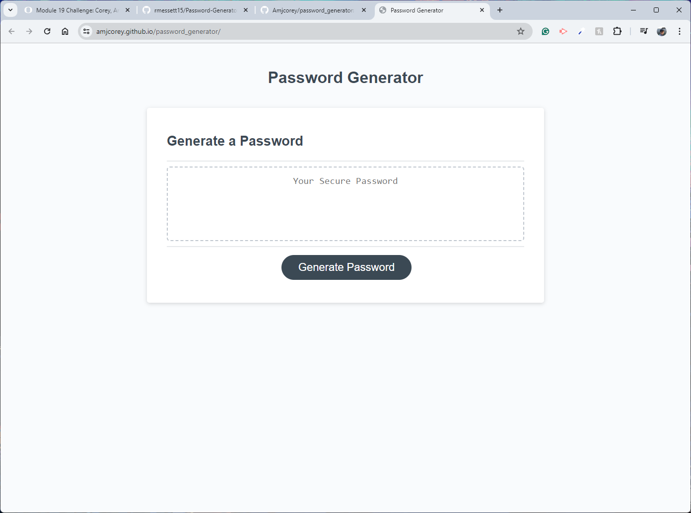

# The humble password generator
If you are looking for a quick and easy password, well you have come to the right repository! This simple designed app generates password of length between 8 to 128 characters (based on user preferences), choice of combinations of uppercase and lowercase letters, numbers, and special characters.

## Screenshot

## Technology Used:

HTML
CSS
JavaScript

## Application
Deployed: https://amjcorey.github.io/password_generator/ 
